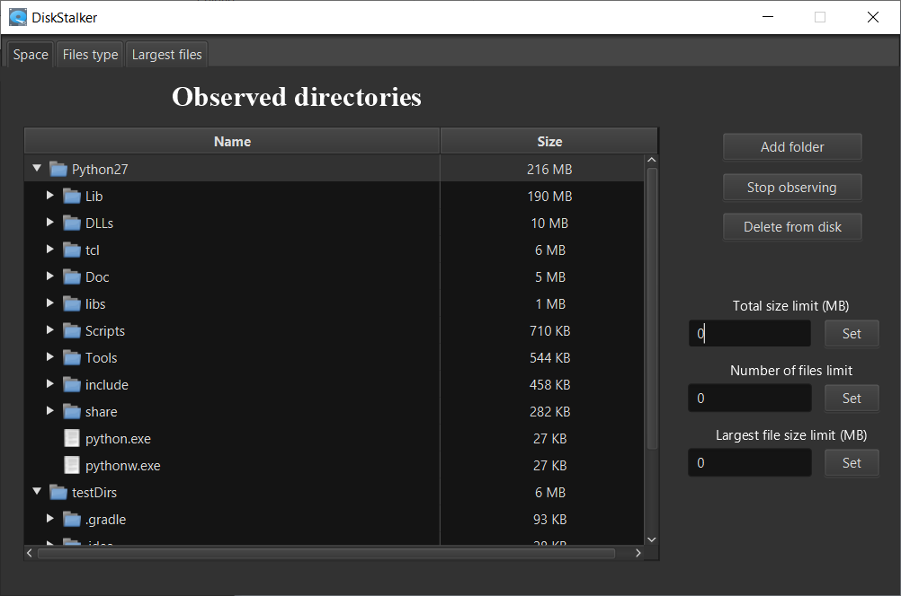
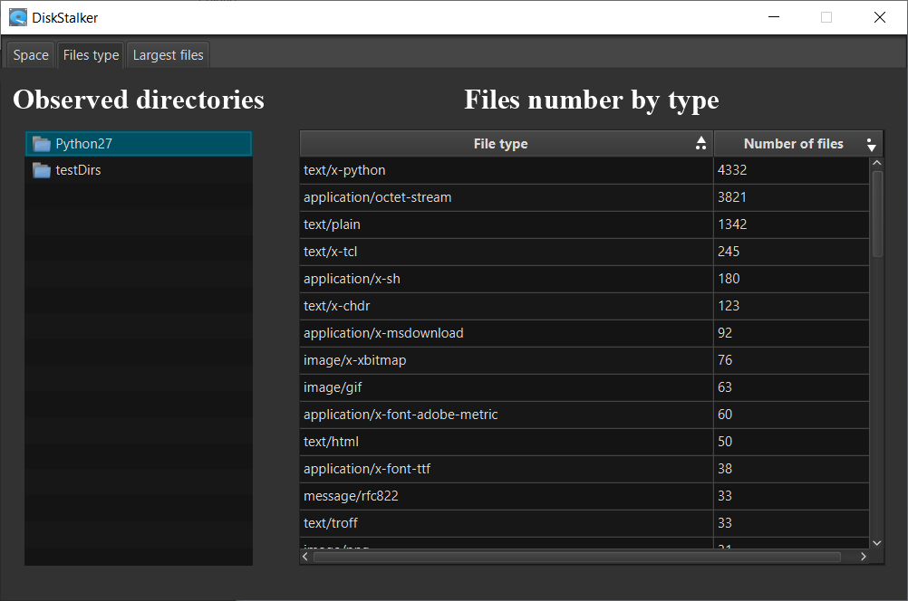
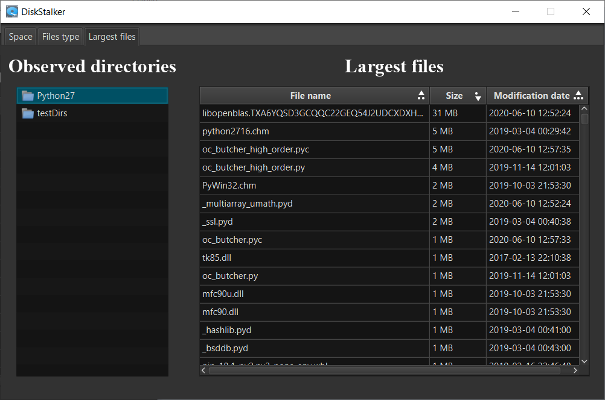
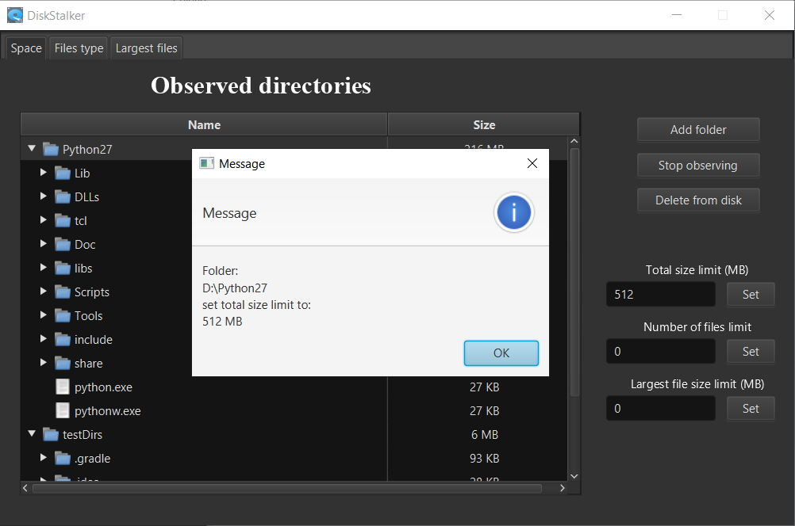
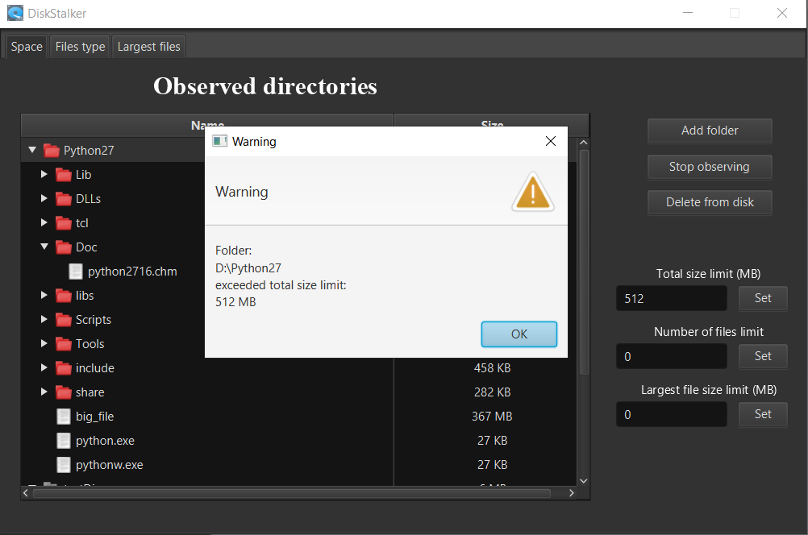

# DiskStalker

`DiskStalker` is a small application for monitoring contents of selected folders. 
It provides the ability to set notifications about three types of statistics:
* total folder size
* number of files inside folder
* size of largest file

App also shows stats about type of files inside selected folder and presents list of largest files.

DiskStalker is using polling method for tracking changes in directory. Better approach is to use [WatchService API](https://docs.oracle.com/javase/7/docs/api/java/nio/file/WatchService.html) but it does not work well on Windows (it blocks the files, so you are not able to delete files from observed folder, see [StackOverflow](https://stackoverflow.com/questions/56847367/can-you-prevent-watchservice-from-locking-files-on-windows)).

## Screenshots

|  |
|:--:|
| *Main View* |
___


|  |
|:--:|
| *Files type view* |
___

|  |
|:--:|
| *Largest files view* |
___

|  |
|:--:|
| *Total folder limit set* |
___

|  |
|:--:|
| *Total folder limit exceeded* |
___

## Usage
Visit [Releases](https://github.com/rivit98/DiskStalker/releases) and download .jar. Then run:
```
java -jar nameOfTheJarFile.jar
```

## Importing
```
git clone https://github.com/rivit98/DiskStalker.git
```
and import as Gradle project


## Used technologies and libraries
* Java 15
* JavaFX
* RxJava3
* Spring (for dependency injection)
* SQLite
* Apache commons IO
* Apache Tika
* Mockito
* JUnit5

## Authors

<table>
  <tr>
    <td align="center"><a href="https://github.com/wnekus"><br /><sub><b>Kamil Wnęk</b></sub></a><br />
    </td>
    <td align="center"><a href="https://github.com/kuczi55"><br /><sub><b>Kamil Koczera</b></sub></a><br /></td>
    <td align="center"><a href="https://github.com/rivit98"><br /><sub><b>Albert Gierlach</b></sub></a><br /></td>
  </tr>
</table>
